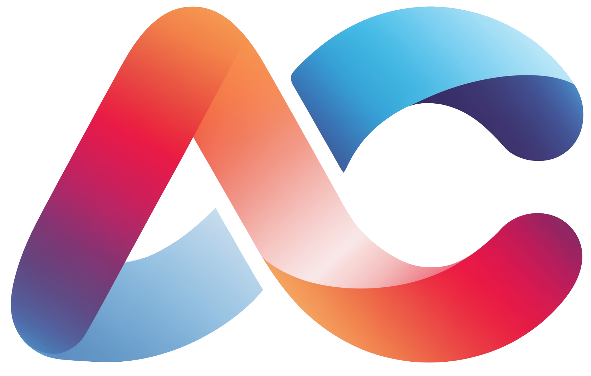

<p align="center">
  
</p>

# Architect Companion

Architect Companion is an opinionated harness for architecture-aware agentic software engineering.

It provides reusable instructions, workflows, architecture metadata, and checks that help AI-assisted development follow a team's architectural standards.

## What It Provides

- Agent instruction templates such as `AGENTS.md`, `CLAUDE.md`, Cursor rules, and Copilot instructions.
- Architecture metadata for boundaries, components, ownership, risks, and exceptions.
- Reusable workflows for planning, implementation, review, refactoring, dependency changes, and ADR creation.
- Executable checks that can run locally and in CI.
- Adapter layers for MCP, hooks, skills, slash commands, and plugins.

## Development

Architect Companion uses Node.js 22.13 or newer and npm.

```bash
npm ci
npm run check
npm run build
node dist/cli.js --help
```

The CLI exposes `architect-companion --help`, `architect-companion --version`, `architect-companion inspect effective-model`, `architect-companion render`, `architect-companion render --check`, `architect-companion doctor`, and `architect-companion upgrade-profile`.

## Repository Contents

- [AGENTS.md](AGENTS.md): guidance for AI agents working in this repository
- [ARCHITECTURE.md](ARCHITECTURE.md): single-page architecture overview and component map
- [docs/README.md](docs/README.md): documentation overview and reading guide
- [docs/product-thesis.md](docs/product-thesis.md): product thesis and design rationale
- [docs/harness-model.md](docs/harness-model.md): tool-independent harness model and target rendering approach
- [docs/architecture-knowledge.md](docs/architecture-knowledge.md): where architectural knowledge is encoded
- [docs/profile-model.md](docs/profile-model.md): how reusable architecture profiles are structured
- [docs/rendering-and-checks.md](docs/rendering-and-checks.md): deterministic rendering, CI adapters, and the boundary between deterministic checks and AI-assisted review
- [docs/glossary.md](docs/glossary.md): shared terminology for the project
- [docs/decisions](docs/decisions): accepted architecture and product decisions
- [profiles/modular-monolith](profiles/modular-monolith): initial placeholder for the modular monolith profile

See [docs/product-thesis.md](docs/product-thesis.md) for the current thinking.
