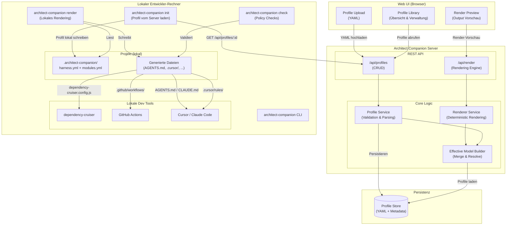
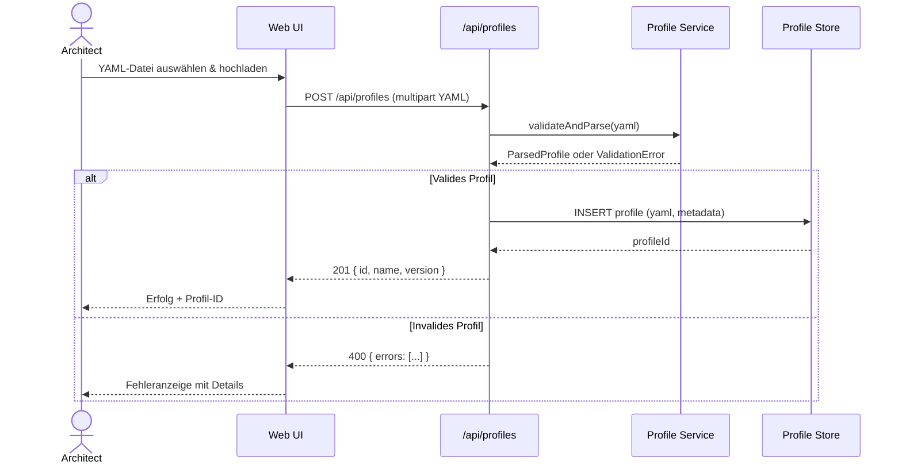
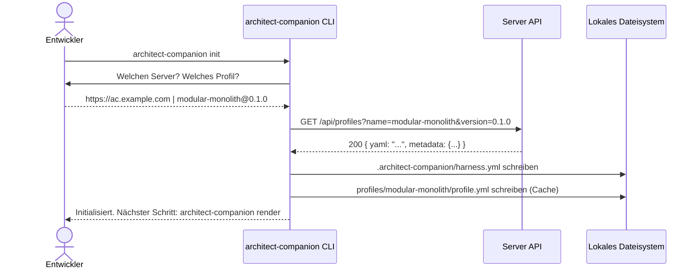
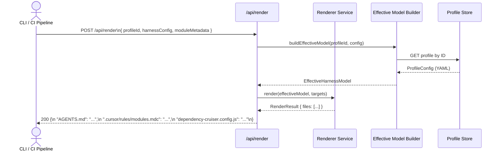
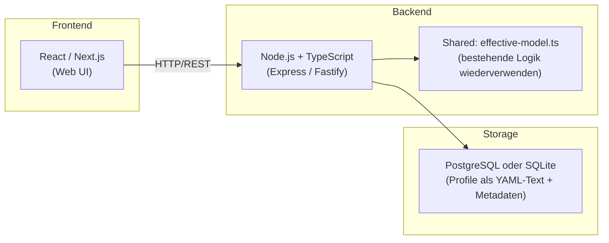

# Server Architecture

Dieses Dokument beschreibt die geplante Server-Architektur für Architect Companion. Ziel ist es, die bisher lokale CLI-Pipeline um eine zentral verwaltete Plattform zu erweitern: Profiles werden über eine Web-UI hochgeladen, in einer Datenbank persistiert und über eine API für Coding Agents abrufbar gemacht.

---

## Systemübersicht



---

## Datenflüsse

### 1. Profile hochladen (Web UI → Server)



### 2. Lokale Initialisierung via CLI



### 3. Rendering via Server API (Remote Render)



---

## Komponenten

### Web UI

| Komponente | Beschreibung |
|---|---|
| Profile Upload | Drag & Drop / Dateiauswahl für YAML-Dateien, inkl. Validierungs-Feedback |
| Profile Library | Übersicht aller gespeicherten Profile mit Name, Version, Stack |
| Render Preview | Vorschau der generierten Ausgabedateien für ein gewähltes Profil |

### Server API

| Endpunkt | Methode | Beschreibung |
|---|---|---|
| `/api/profiles` | `GET` | Alle Profile auflisten (Name, Version, Stack) |
| `/api/profiles` | `POST` | Neues Profil hochladen (YAML, multipart) |
| `/api/profiles/:id` | `GET` | Einzelnes Profil abrufen (YAML + Metadata) |
| `/api/profiles/:id` | `DELETE` | Profil löschen |
| `/api/render` | `POST` | Effektives Modell rendern (gibt Ausgabedateien zurück) |

### CLI-Erweiterungen

| Befehl | Beschreibung |
|---|---|
| `architect-companion init` | Verbindet Projekt mit Server, lädt Profil herunter, schreibt `harness.yml` |
| `architect-companion render` | Rendert Ausgabedateien lokal (aus gecachtem oder lokalem Profil) |
| `architect-companion render --remote` | Rendering via Server-API statt lokal |
| `architect-companion check` | Policy Checks mit externen Tools (dependency-cruiser etc.) |
| `architect-companion profile sync` | Profil-Cache mit Serverversion abgleichen |

---

## Ausgabe-Formate der Render API

Die Render API gibt je nach konfigurierten Targets verschiedene Dateien zurück:

```
targets:
  agentsMd       → AGENTS.md, CLAUDE.md
  cursor         → .cursor/rules/<module>.mdc
  dependencyCruiser → .dependency-cruiser.config.js
  githubActions  → .github/workflows/architect-check.yml
```

Der Client (CLI oder CI) schreibt diese Dateien in das lokale Projektverzeichnis.

---

## Technologie-Überlegungen



Die bestehende `effective-model.ts`-Logik lässt sich direkt im Server-Backend wiederverwenden — kein Rewrite nötig. Der Server wird zum Host der bisher nur lokalen Resolver- und Renderer-Pipeline.
