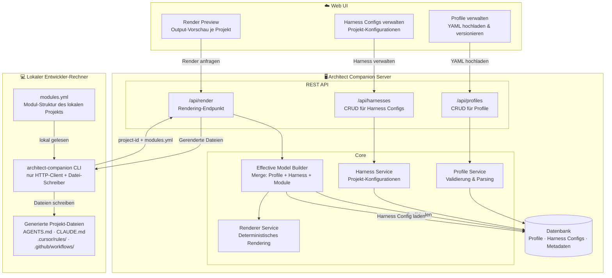
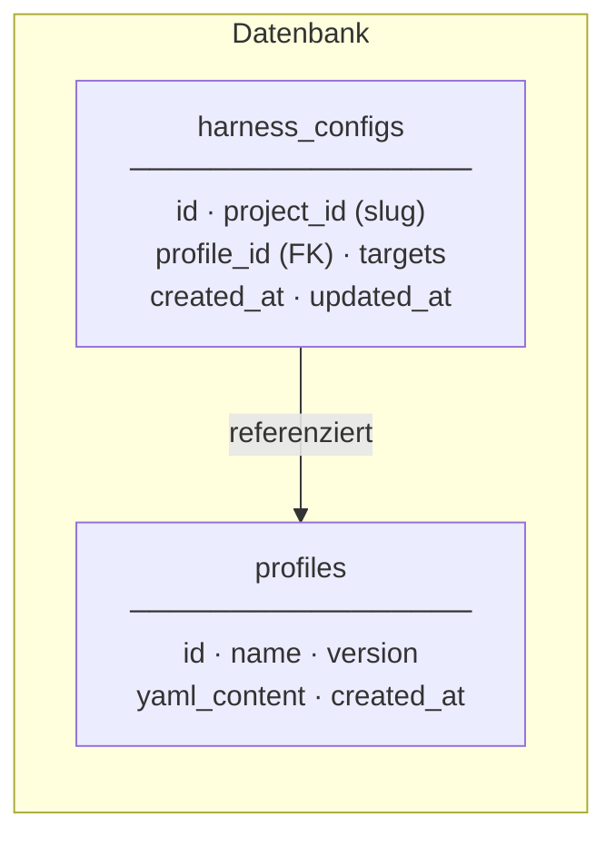
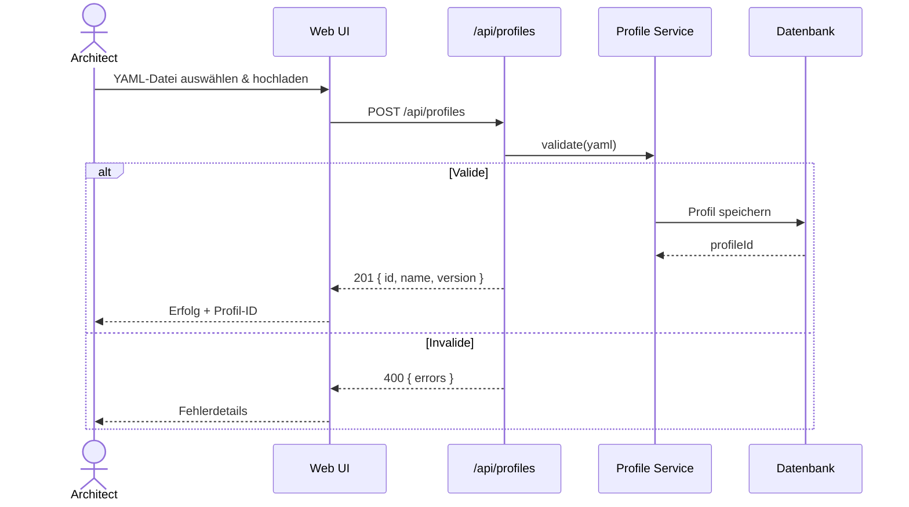
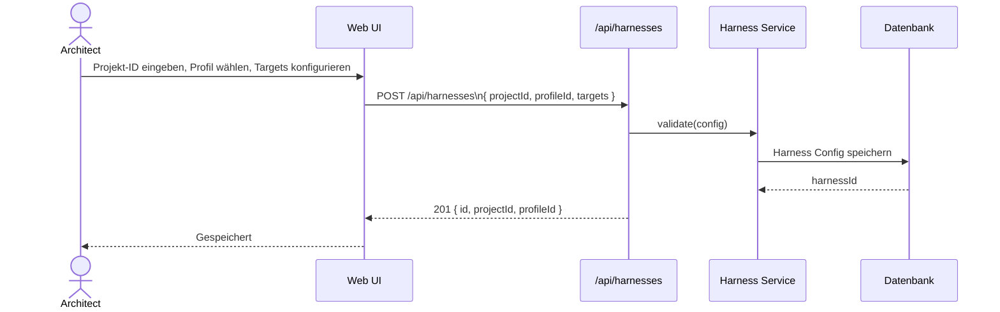
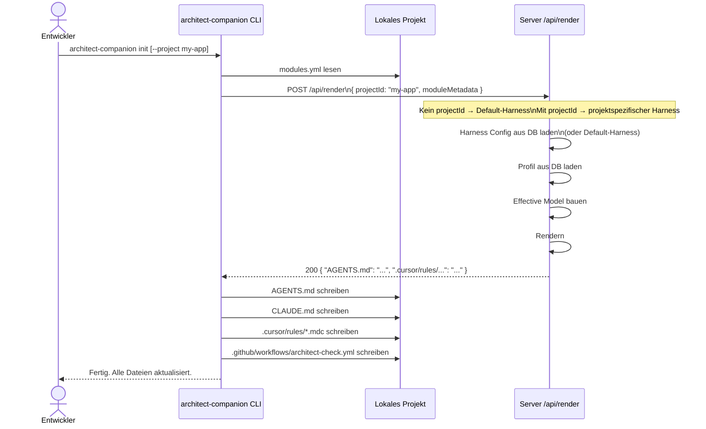
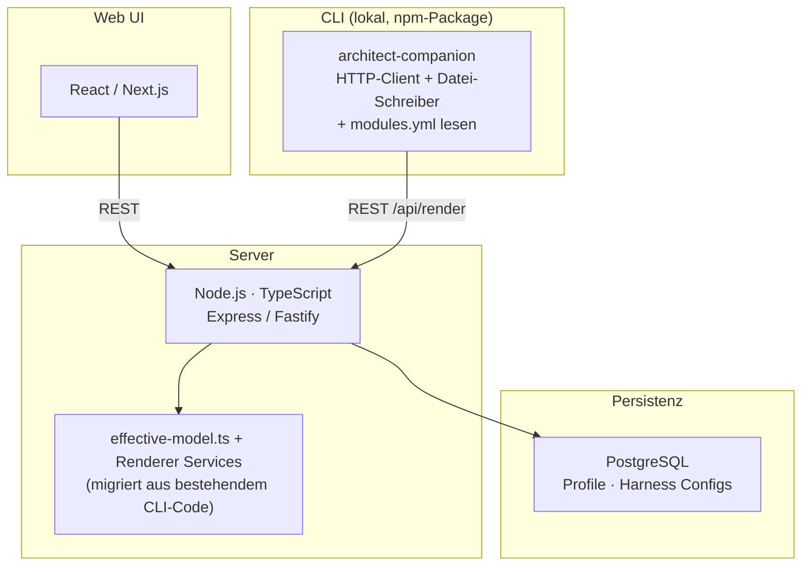

# Zielbild: Server-Architektur

Dieses Dokument beschreibt das langfristige Zielbild von Architect Companion als Server-Plattform. Die gesamte Logik — Profile, Harness Configs, Effective Model Building und Rendering — läuft auf dem Server. Auf dem lokalen Entwickler-Rechner verbleibt ausschließlich die CLI, die dem Server ihre Projekt-ID und die lokalen Modul-Metadaten mitgibt und fertig gerenderte Dateien zurückbekommt.

---

## Systemübersicht

---

## Datenbank-Schema

Ein Harness Config ist die Server-seitige Entsprechung der bisherigen `harness.yml`: Sie verknüpft ein Projekt (per `project_id`-Slug) mit einem Profil und definiert die aktiven Targets. `modules.yml` bleibt lokal, da sie die tatsächliche Code-Struktur des Projekts beschreibt.

---

## Datenfluss 1: Profil hochladen

---

## Datenfluss 2: Harness Config anlegen

---

## Datenfluss 3: CLI rendert Dateien

---

## Render-Outputs der API

Je nach konfigurierten Targets im Harness Config liefert die Render API verschiedene Dateien zurück:

| Target | Generierte Datei(en) |
|---|---|
| `agentsMd` | `AGENTS.md`, `CLAUDE.md` |
| `cursor` | `.cursor/rules/<modul>.mdc` |
| `dependencyCruiser` | `.dependency-cruiser.config.js` |
| `githubActions` | `.github/workflows/architect-check.yml` |

---

## CLI-Befehle (Zielbild)

| Befehl | Beschreibung |
|---|---|
| `architect-companion init` | Rendert mit Default-Harness, schreibt alle Dateien ins Projekt |
| `architect-companion init --project <id>` | Rendert mit projektspezifischem Harness vom Server |
| `architect-companion sync` | Dateien neu rendern lassen, z. B. nach Profil-Update auf dem Server |
| `architect-companion status` | Zeigt Server-URL, Projekt-ID, aktives Profil |

---

## Tech Stack (Zielbild)

